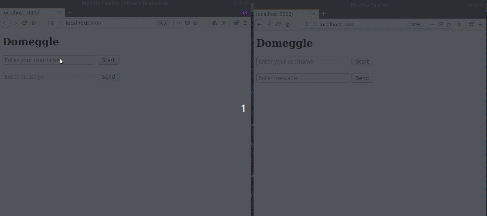

# Domegle
Dummy + Omegle

This is a omegle like chat server, which I created just for hands on purpose. It uses *Kafka (which needs Zookeeper), Redis, NgiNx, NodeJS, WebSockets*. Had been reading about these technologies for some time and wanted to make use of these in a real application which is really simple.

The main chat server uses NodeJS. A microservice to match random strangers is written using Java.

There is **a lot** that has not been taken care of in this code (e.g. recovering from an instance going down).

## How to run

**Pre-requisites**: docker & docker-compose

### Build docker images
<code>
./build-docker.sh
</code>

### Start services with docker-compose
<code>
docker-compose -f docker-compose.yml  up -d --scale web=<NUM_SERVERS>
</code>

`NUM_SERVERS` - number of instances for the nodejs application server (e.g. 2)

## Resources Uses:

Websockets: Shamelessly copied from https://github.com/wahengchang/nodejs-websocket-example

Docker for kafka and zookeeper: https://github.com/simplesteph/kafka-stack-docker-compose

